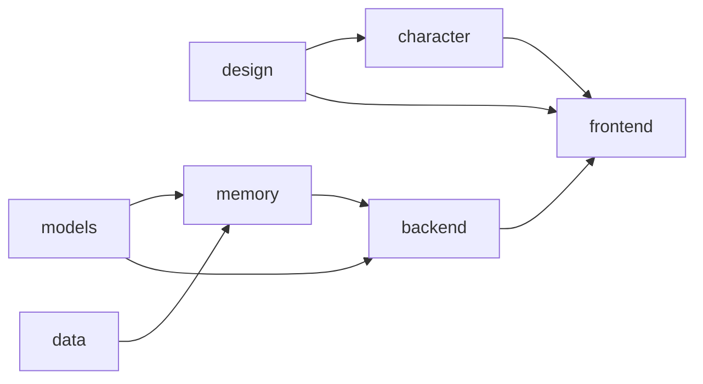

# 系统架构

按 [ARCHITECTURE-STANDARD.md](ARCHITECTURE-STANDARD.md) 的八节写。接口签名与数据表字段在 [CONTRACTS.md](CONTRACTS.md)，本文只引用不复述。决策的理由在 [DECISION-LOG.md](DECISION-LOG.md)。

## 1 · 目标与质量属性

丘丘是常驻桌面的 AI 桌宠：记住用户说过的话，性格随相处沉淀，每一次「记住 / 没记 / 想起来」都在界面上可见。

质量属性排序，冲突时前者优先：

1. **记忆过程看得见**：筛选、写入、合并、召回每一步都以事件外发到界面
2. **首字延迟**：用户发送到第一个字出现的时间
3. **成本**：每轮对话的模型调用次数与 token
4. **断网能用**：语音识别与活动检测本地运行，首次下载权重后不依赖网络

## 2 · 约束

| 约束 | 来源 |
|---|---|
| 丘丘视觉形象仅限非商业用途，转产品必须替换 | 许可证：[Emotion Ball](https://github.com/sam70361/aora-bot) 形象条款 |
| Emotion Ball 引擎与表情数据非商业免费，商业需另行授权 | 许可证：Emotion Ball 双许可 |
| SimpleMem 可商用 | 许可证：MIT |
| SenseVoice、silero-vad、sherpa-onnx 可商用 | 许可证：各自的开源许可 |
| 语音合成走官方接口（豆包语音或 Azure），不用逆向的 Edge 朗读通道 | 许可证：官方服务条款 |
| 所有记忆数据本地存储，不上传 | 自己定的 |
| 被动采集的原始音频只存指针，处理完即可删除 | 自己定的 |
| 图片理解与对话共用一个 DeepSeek key | 自己定的 |
| 语音识别与活动检测全本地 | 自己定的 |
| 目标平台 macOS 与 Windows，开发在 macOS | 自己定的 |
| Electron 透明置顶窗口在两个平台行为不同，需各自验证 | 平台限制 |
| SenseVoice int8 权重约 200MB，首次运行下载 | 平台限制 |

## 3 · 系统边界

**系统内**：Electron 两个窗口与网页端、FastAPI 服务、记忆中间件、LanceDB 与 SQLite 与磁盘文件、本地模型权重、Emotion Ball 四个 JS 文件（vendor 进仓库，不出网）。

**系统外**，每条写调用方与失败处理：

| 依赖 | 端点 | 调用方 | 失败处理 |
|---|---|---|---|
| DeepSeek Chat | api.deepseek.com | 对话编排；记忆中间件（压缩、合成、检索规划、性格归纳） | 重试 2 次，间隔 1s、4s。编排仍失败：SSE `error` 事件带 hint。中间件仍失败：本次 `ingest` 返回空 `accepted`，记 `run_metrics`，原始消息保留在 `messages` 表，不重试 |
| DeepSeek Vision | api.deepseek.com | 后端：编排处理主动附件，`/ingest` 处理 `ambient_image` | 主动附件失败：不生成描述，原话照常进 prompt 与 `ingest`，`blob_id` 保留。被动图片失败：`/ingest` 返回 error 带 hint |
| Seedream | 火山方舟 | 对话编排 | 回复文字说明本次画不了，不重试 |
| 豆包端到端实时语音 | 火山引擎 WebSocket | 对话编排 | 连接失败或中断：`/voice/session` 返回 error 带 hint，前端提示切文字 |
| 语音合成 | `openspeech.bytedance.com`（豆包）或 `{region}.tts.speech.microsoft.com`（Azure） | 对话编排 | 无语音，口型不动，文字照常，本次不重试 |
| 权重下载：Qwen/Qwen3-Embedding-0.6B | HuggingFace | 记忆中间件嵌入初始化，只在首次运行 | 缺失则后端启动失败，hint 给 `HF_ENDPOINT` 镜像与手动放置路径 |
| 权重下载：SenseVoice、silero-vad | GitHub releases | 模型注册表初始化，只在首次运行 | 缺失则语音输入不可用，其余照常，`/health` 报告缺失项 |

## 4 · 解决方案策略

**分层。** 从用户看得见的到看不见的八层，每层落在第 5 节的一个块里：

| # | 层 | 职责 | 落在哪个块 |
|---|---|---|---|
| 1 | 端 | 桌面常驻窗口 / 网页 | frontend |
| 2 | 界面 | 丘丘表情 + 对话窗口 + 记忆事件侧栏 | frontend、character |
| 3 | 对话编排 | 拼 prompt · 调模型 · 分发回复 · 送去写入 | backend |
| 4 | 记忆中间件 | 筛选 · 压缩 · 合成 · 检索 · 冷热调度 · 性格沉淀 | memory |
| 5 | 存储 | 热 / 冷 LanceDB · SQLite · 磁盘文件 | data |
| 6 | 模型 | Chat / Vision / ASR / VAD / TTS / RealtimeVoice 统一适配 | models |
| 7 | 人格 | 安全边界 · 预设 · 相处性格 · 当前人格合成 | memory |
| 8 | 输入 | 主动经界面 · 被动直连中间件 | frontend（主动输入界面）、backend（被动采集入口） |

设计规范由 design 块交付，是 character 与 frontend 的输入。

**两端一套。** 桌面端 Electron 两个 BrowserWindow：桌宠窗口（透明、置顶、无边框、常驻）与主窗口（三栏），两个渲染进程经主进程 IPC 通信。网页端同一套 React 代码，单页面，丘丘嵌在页面里。两端共用同一形象与同一记忆。

**记忆按 Omni-SimpleMem 三段式**：选择性摄入 → 结构化存储 → 意图感知检索。六个环节：筛选（留 / 丢 / 拿不准，带分数与理由，只筛被动采集）、压缩（拆自包含事实，代词解析，时间绝对化；日记随笔另出摘要）、合成（同义合并，旧事实作废）、检索规划（按意思 / 按字面 / 按标签，计划器选路径与深度，先热后冷）、冷热调度（按访问频率与时效）、性格沉淀（周期归纳相处特征）。每个环节的判断以事件外发，这是「记忆看得见」的数据源。

**存储分冷热**，依据是访问频率与时效，不是内容类型。热：近 30 天事实、当前待办、活跃话题、当前人格快照，LanceDB 常驻表，三层索引全建。冷：全量历史与作废版本、相册摘要、日记摘要、性格档案，LanceDB 归档表，仅摘要索引。原图、原文、音频片段是磁盘文件，冷存储里存指针。会话、消息、可见记忆、事件日志、设置、供应商、运行指标在 SQLite。

**输入两条路。** 主动输入（打字、说话、传图、写日记）从界面进来，经编排到中间件，跳过筛选仍压缩。被动采集（常开麦克风、摄像头）不经界面，直连中间件的 `/ingest`，必须筛选。AI 的回复走主动这一路。

**人格三段合成**：预设打底 → 相处覆盖 → 边界否决。安全边界（不模拟恋爱关系、不诱导依赖、不替代医疗法律心理建议）是代码常量，不可关闭；预设是热情 / 安静 / 可爱 / 毒舌四选一，或手调主动性、话量、情绪浓度、玩笑尺度四个滑块，或不设；相处性格（称呼习惯、玩笑尺度、话题偏好、回应长度）由性格沉淀写入冷存储。合成结果缓存为热存储快照。

**语音两种链路**，`.env` 的 `VOICE_MODE` 切换，编排选路，记忆中间件不感知。级联：VAD → ASR → Chat → TTS，四段各自流式。端到端：`RealtimeVoice` 适配器，音频直进直出，记忆与人格以文本注入系统提示，模型返回输入与输出两路转写供写入记忆，口型吃输出音频的包络。

**模型选型。**

> 快照：写于 2026-09-05，代码存在后以代码为准。

| 能力 | 实现 | 调用方 | 计费 |
|---|---|---|---|
| Chat | DeepSeek `deepseek-v4-flash` | 编排；中间件 | 远程，按 token |
| Vision | DeepSeek `deepseek-v4-flash-vision-exp` | 后端（编排附件、`/ingest` 图片） | 远程，同一个 key |
| ASR | sherpa-onnx + SenseVoice int8 | 后端（语音输入、被动采集） | 本地 |
| VAD | silero-vad | 后端（语音输入、被动采集） | 本地 |
| TTS | 豆包语音合成 2.0（默认）/ Azure 语音服务 | 编排 | 豆包 3 元每万字符；Azure F0 档每月 50 万字符免费 |
| Image Gen | Seedream（可选） | 编排 | 远程，按张 |
| RealtimeVoice | 豆包端到端实时语音大模型（O2.0） | 编排 | 远程，按 token；试用额度 100 万字符 |
| Embedding | Qwen/Qwen3-Embedding-0.6B，1024 维 | 中间件 | 本地 |

## 5 · 构建块视图

七块，一块一个目录、一个分支、一个 Agent。下图是规则：只允许沿箭头方向依赖，箭头从被依赖方指向依赖方，也是合并顺序。

### design

- 目录：`design/`
- 分支：`design`
- 职责：产出视觉、交互、状态机、表情映射、情绪规则的规范文档与设计令牌
- 对外接口：`design/character.md` `design/state-machine.md` `design/emotion-rules.md`（调用方 character）；`design/interaction.md` `design/memory-panel.md` `design/tokens.css`（调用方 frontend）；四个演示场景的内容（调用方 backend）。对应 CONTRACTS § 6
- 依赖：无
- 受哪些 AD 约束：AD-1、AD-14
- 未解决的问题：开工前必须定：无。边做边定的见 [01-design.md](agents/01-design.md)

### frontend

- 目录：`apps/desktop/` `apps/web/`
- 分支：`frontend`
- 职责：Electron 两个窗口与托盘、React 界面、SSE 与 WebSocket 消费、IPC 转发、状态机驱动
- 对外接口：无下游调用方。消费 CONTRACTS § 1 的 HTTP / SSE / WebSocket、§ 2 的 IPC 桥、character 的导出
- 依赖：backend、character、design
- 受哪些 AD 约束：AD-1、AD-5、AD-11、AD-13、AD-14
- 未解决的问题：开工前必须定：网页端没有 IPC 时，状态机与回复流走前端内存事件总线，同一份状态机代码。边做边定的见 [02-frontend.md](agents/02-frontend.md)

### backend

- 目录：`services/api/`
- 分支：`backend`
- 职责：路由、对话编排、SSE 与 WebSocket 出口、事件广播、被动采集入口、场景回放、定时任务
- 对外接口：CONTRACTS § 1 全部路由与事件（调用方 frontend）
- 依赖：memory、models、data（只用 SQLite 的后端归属表，见第 7 节）
- 受哪些 AD 约束：AD-3、AD-5、AD-6、AD-7、AD-8、AD-13、AD-14、AD-15、AD-16
- 未解决的问题：开工前必须定：级联语音的 pcm 通道是 `WS /voice/stream`；场景回放的时间偏移经 `ingest()` 的 `ts` 与 `recall()` 的 `now` 传入，不改系统时钟；`event_log` 由中间件写，后端只读并广播。边做边定的见 [03-backend.md](agents/03-backend.md)

### data

- 目录：`packages/data/`
- 分支：`data`
- 职责：LanceDB、SQLite、磁盘文件的读写，schema 迁移，冷热搬运的执行
- 对外接口：`qiuqiu_data.lance`（upsert / get / query_vector / query_fts / query_scalar / mark_superseded）、`qiuqiu_data.sqlite`（八张表的读写与迁移）、`qiuqiu_data.tiering`（promote / demote_stale / nightly）、`qiuqiu_data.blobs`（put / get / path）。调用方 memory；backend 只用 sqlite 的后端归属表。对应 CONTRACTS § 5
- 依赖：无
- 受哪些 AD 约束：AD-7、AD-9、AD-10
- 未解决的问题：开工前必须定：热表条数不足 1 万时不建向量索引，LanceDB 全扫，过万后建 HNSW，`query_vector` 对外行为不变。边做边定的见 [04-data.md](agents/04-data.md)

### memory

- 目录：`packages/memory/`
- 分支：`memory`
- 职责：记忆中间件六个环节、事件总线、人格三段合成与性格沉淀
- 对外接口：`MemoryFacade` 五个方法、`PersonaService` 四个方法、`MemoryEvent`。调用方 backend。对应 CONTRACTS § 3、§ 7
- 依赖：data、models（Chat）
- 受哪些 AD 约束：AD-2、AD-3、AD-4、AD-6、AD-7、AD-8、AD-9、AD-10、AD-11、AD-12、AD-13、AD-14、AD-15、AD-16
- 未解决的问题：开工前必须定：被动采集的筛选用 SimpleMem 多模态路径的 `AudioEntropyTrigger` 与 `VisualEntropyTrigger`，转写文本再过 Jaccard 去重，统一映射为 `FilterDecision`；性格沉淀由后端定时任务触发，本块不自带调度器。边做边定的见 [05-memory.md](agents/05-memory.md)

### models

- 目录：`packages/models/`
- 分支：`models`
- 职责：模型能力的抽象接口、注册表、供应商实现、mock
- 对外接口：CONTRACTS § 4 的 Protocol 与 `qiuqiu_models.registry.get()` `list_providers()`。调用方 memory（Chat）、backend（全部）
- 依赖：无
- 受哪些 AD 约束：AD-8、AD-13、AD-16
- 未解决的问题：开工前必须定：mock 也记 `run_metrics`，`provider` 为 `mock`；SenseVoice 与 silero 从各自 GitHub releases 下载并校验 sha256。边做边定的见 [06-models.md](agents/06-models.md)

### character

- 目录：`packages/character/`
- 分支：`character`
- 职责：Emotion Ball 封装、状态机、事件到表情映射、情绪推断
- 对外接口：`createQiuqiu` `setEmotion` `setState` `feedEnvelope` `applyEvent` `inferEmotion` 与类型导出。调用方 frontend。对应 CONTRACTS § 6
- 依赖：design
- 受哪些 AD 约束：AD-1、AD-14
- 未解决的问题：开工前必须定：事件表情优先于状态表情，持续时间到后回当前状态的表情，`speaking` 期间口型不受事件表情影响。边做边定的见 [07-character.md](agents/07-character.md)

## 6 · 运行时视图

只写跨越两个以上块的步骤。

### 一次文本对话

1. frontend：用户发送，状态机本地进 `thinking`，`POST /chat`
2. backend 编排 → memory：`recall(query, budget, now)`
3. memory：检索规划选路径，先查热；未命中且涉及久远内容时下探冷，命中的冷条目整体回热；发 `recall` 事件
4. backend 编排：`PersonaService.current()` 的人格快照 + 召回结果 + 本会话历史拼成 prompt
5. models：Chat 流式生成
6. backend → frontend：SSE `meta` `delta`；桌面端主窗口收流后经 IPC 转发桌宠窗口
7. frontend / character：首个 `delta` 进 `speaking`，气泡逐字显示；有 TTS 时 `audio` 事件的 `rms` 驱动口型
8. backend 编排 → memory：`done` 后 `ingest()` 两次，用户这句与 AI 这句，`source=DIALOGUE`
9. memory：跳过筛选 → 压缩 → 合成 → 写热存储；发 `write` `merge` 事件
10. backend → frontend：事件经 `/events` 广播，侧栏追加，character 切表情
11. backend 定时任务：轮数达阈值时后台调 `run_consolidation()`（见性格沉淀）

### 语音输入，级联模式

1. frontend：按住说话，`POST /voice/session` 得 `mode=cascade`，`WS /voice/stream` 上行 pcm，状态机进 `listening`
2. backend：VAD 判有语音 → ASR 流式，下行 `partial`
3. frontend：`partial` 显示在输入条
4. backend：静音收尾，下行 `final`
5. frontend：拿 `final` 文本 `POST /chat`，此后同「一次文本对话」
6. backend 编排：回复流式的同时并行 TTS，音频块与 `rms` 经 SSE `audio` 事件下行
7. frontend / character：解码播放，`rms` 喂 `feedEnvelope`

### 被动采集环境音

1. frontend：常开麦克风每 3 秒切片，`POST /blobs` 得 `blob_id`，`POST /ingest`
2. backend：读 blob → VAD → 有语音则 ASR → `ingest(text, source=AMBIENT_AUDIO, blob_id)`
3. memory：筛选，发 `filter` 事件；`reject` 到此为止
4. backend → frontend：`filter.reject` 侧栏打灰，character 不切表情
5. memory：`accept` 的继续压缩 → 合成 → 写热存储，发 `write` 事件
6. frontend / character：侧栏高亮，表情切 `10`

### 三个月后问旧事

1. backend 场景回放：`clock_offset_days` 转成偏移后的时间，作为 `recall()` 的 `now` 与 `ingest()` 的 `ts`
2. memory：检索规划识别时间跨度，热表未命中，下探冷表
3. memory → data：`promote(fact_ids)` 整条回热，更新 `last_hit_at`
4. memory：发 `recall` 事件，`cold_promoted` 非空
5. backend → frontend：侧栏标路径与回热，character 切 `40`
6. backend 编排：召回结果进 prompt，回复引用旧事

### 性格沉淀

1. backend 定时任务：累计轮数达 `settings.consolidate_every`，后台调 `PersonaService.run_consolidation()`
2. memory → data：读 `messages` 表最近 N 轮原始会话，不读事实表
3. memory → models：Chat 归纳四个维度、称呼习惯、话题偏好，得 `Learned`
4. memory → data：写 `persona_learned` 新版本，写冷存储性格档案
5. memory：重算热存储 `persona_snapshot`
6. backend 编排：下一轮 `PersonaService.current()` 返回新快照，回复语气变化

## 7 · 跨领域概念

- **错误格式**：HTTP、SSE `error` 事件、WebSocket `error` 帧统一 `{ code, message, hint }`，`hint` 必填
- **trace_id**：`/chat` 与 `/ingest` 生成，贯穿 `ingest`、事件信封、`run_metrics`
- **事件信封**：CONTRACTS § 1，`id` 为 `evt_` 加 `event_log` 自增 id，`/events?since=` 的游标是该自增 id
- **配置**：只从 `.env` 读；阈值热更新经 `/config/thresholds` 存 SQLite `settings`
- **密钥**：只从环境变量读，不进日志，不回传前端，`/providers` 只回 `has_key`
- **计量**：每次模型调用记 `run_metrics`，mock 也记
- **时间**：所有时间戳 ISO 8601 UTC；事实的 `valid_from` 在压缩时绝对化
- **数据归属**，谁写谁读：

| 表 / 存储 | 写入方 | 读取方 |
|---|---|---|
| `facts_hot` `facts_cold` | memory | memory |
| `data/blobs/` | backend | backend、memory |
| `sessions` `messages` | backend | backend、memory（性格沉淀） |
| `visible_memory` | memory | backend（经 `MemoryFacade`） |
| `event_log` | memory | backend（`since` 游标查询） |
| `persona_learned` | memory | memory |
| `settings` | backend | backend、memory |
| `providers` | backend | backend |
| `run_metrics` | models、backend | backend |
| `persona_snapshot`（热存储） | memory | memory |

## 8 · 架构决策

### AD-1 — 状态机切换不经过后端

- 约束范围：frontend、character、backend
- 防止的分歧：后端发状态事件与前端本地推断并存，两个状态源不一致
- 规则：四态由前端按本地事件切换：发送进 `thinking`，首个 `delta` 进 `speaking`，`done` 回 `idle`，按住说话进 `listening`。后端不发状态事件。桌面端经 IPC `setPetState`，网页端经前端内存事件总线
- 状态：已采纳

### AD-2 — 当前人格读热存储快照，不在请求路径合成

- 约束范围：memory、backend
- 防止的分歧：编排每次请求现拼人格，与快照内容不同步
- 规则：`PersonaService.current()` 只读 `persona_snapshot`；快照在预设改动或性格沉淀完成后重算；编排不直接读预设、滑块或性格档案
- 状态：已采纳

### AD-3 — 主动输入跳过筛选仍压缩，被动采集必筛

- 约束范围：backend、memory
- 防止的分歧：输入层与中间件对「什么算噪音」各自判断
- 规则：`Source.DIALOGUE` 与 `JOURNAL` 不经筛选直接压缩；`AMBIENT_AUDIO` 与 `AMBIENT_IMAGE` 先经筛选，每次判断发 `filter` 事件。分流只发生在 `MemoryFacade.ingest()` 内部，后端不做预筛。筛选判定只有 `accept` 继续往下走，`uncertain` 与 `reject` 都到此为止、只发事件不落库（CONTRACTS § 3）
- 状态：已采纳

### AD-4 — 性格沉淀读 SQLite 原始会话，不读记忆库

- 约束范围：memory、data
- 防止的分歧：从压缩后的事实归纳与从原话归纳得出不同结果
- 规则：`run_consolidation()` 的输入只来自 `messages` 表最近 N 轮；不读 `facts_hot` `facts_cold` `visible_memory`
- 状态：已采纳

### AD-5 — 桌面端只有主窗口持有 SSE

- 约束范围：frontend
- 防止的分歧：两个渲染进程各自建连接、各自重连
- 规则：主窗口是 `/chat` `/events` `/voice/stream` 的唯一消费者；桌宠窗口的流式数据全部经主进程 IPC `forwardDelta` `forwardDone` `setPetState` 转发；桌宠窗口的输入经 `submitFromPet` 交主窗口发出
- 状态：已采纳

### AD-6 — AI 回复也写入记忆

- 约束范围：backend、memory
- 防止的分歧：只记用户话，AI 的承诺与建议无从召回
- 规则：每轮 `done` 后编排调 `ingest()` 两次，`speaker=user` 与 `speaker=assistant`，均为 `Source.DIALOGUE`
- 状态：已采纳

### AD-7 — 记忆读写只经 MemoryFacade 与 PersonaService

- 约束范围：backend、memory、data
- 防止的分歧：服务层绕过门面直接读写事实表或人格档案
- 规则：事实、可见记忆、人格档案、事件日志的读写只经 `MemoryFacade` 五个方法与 `PersonaService`；`sessions` `messages` `settings` `providers` `run_metrics` 由后端直接经 `qiuqiu_data.sqlite` 读写；归属见第 7 节数据归属表
- 状态：已采纳

### AD-8 — 模型调用只经 registry

- 约束范围：backend、memory、models
- 防止的分歧：调用方各自 import 供应商实现，切换供应商要改多处
- 规则：上层只 import `qiuqiu_models.base` 的 Protocol，实例经 `qiuqiu_models.registry.get(capability)` 获取；`providers/` 只被 registry import
- 状态：已采纳

### AD-9 — 事实不物理删除

- 约束范围：memory、data
- 防止的分歧：合成与删除各自决定是否删行，历史不可追溯
- 规则：作废写 `valid_to` 与 `superseded_by`；`DELETE /memories/{id}` 级联作废，不删行；冷热搬运整条搬、搬完删源表行，是唯一的删行操作
- 状态：已采纳

### AD-10 — 冷热分层按访问频率与时效

- 约束范围：memory、data
- 防止的分歧：按内容类型分层与按访问分层并存
- 规则：热表存近 30 天命中过的事实；`last_hit_at` 早于 30 天的降冷；召回命中冷条目整条回热并更新 `last_hit_at`。降冷由后端定时任务调 `tiering.nightly()`，判断标准由 memory 定，执行由 data 做
- 状态：已采纳

### AD-11 — 预设为空是真空

- 约束范围：memory、frontend
- 防止的分歧：「不设」被实现为中等滑块值
- 规则：`preset` 为 `null` 时不生成 `preset_block`，prompt 里不出现任何滑块描述；前端「不设」开关对应 `PUT /persona/preset` 传 `null`
- 状态：已采纳

### AD-12 — 人格合成顺序

- 约束范围：memory
- 防止的分歧：三段的覆盖方向各自理解
- 规则：`prompt_persona = boundary_block + preset_block + learned_block`；`learned_block` 覆盖 `preset_block` 同名维度；`boundary_block` 是代码常量，永远在最前且不可关闭
- 状态：已采纳

### AD-13 — 语音模式由编排选路

- 约束范围：backend、models、memory
- 防止的分歧：中间件或前端按语音模式分支处理
- 规则：`VOICE_MODE` 只在编排读取；级联走 VAD → ASR → Chat → TTS，端到端走 `RealtimeVoice`；两种模式进入 `ingest()` 的都是文本与 `speaker`；前端只感知 `/voice/session` 返回的 `mode`
- 状态：已采纳

### AD-14 — 记忆判断以事件外发，事件是可见性的唯一数据源

- 约束范围：memory、backend、frontend、character
- 防止的分歧：前端或后端从回复内容推断「记住了什么」
- 规则：筛选、写入、合并、召回每次判断由中间件发一条事件，经事件总线写 `event_log` 并广播；侧栏与丘丘表情只消费事件，不读记忆库、不解析回复
- 状态：已采纳

### AD-15 — 图片描述由后端调 Vision 生成

- 约束范围：backend、memory
- 防止的分歧：中间件与后端各自调 Vision
- 规则：进入 `ingest()` 的只有文本与 `blob_id`；主动附件的描述由编排生成，被动图片的描述由 `/ingest` 生成；中间件不 import Vision
- 状态：已采纳

### AD-16 — 出网调用失败返回带 hint 的错误

- 约束范围：backend、models
- 防止的分歧：某处失败静默换 mock，界面看不出真假
- 规则：mock 只在 `MODELS_MOCK=1` 时由 registry 全量返回；运行时任何出网失败按第 3 节的失败处理返回带 `hint` 的错误或明确降级，不换 mock；失败记 `run_metrics`
- 状态：已采纳

### AD-17 — 皮肤只覆盖令牌，丘丘的样子只由 character 决定

- 约束范围：frontend、character、design
- 防止的分歧：同一套「二次元」被做两遍——前端在组件里写死粉色，character 又改一遍球的配色，两边各调各的，永远对不齐
- 规则：页面的样子只由 `design/tokens.css` 里 `:root[data-skin=…]` 的令牌覆盖决定，组件里不出现具体颜色；丘丘的样子只由 `CharacterLook` 决定，`apps/web/src/skin.ts` 里每个皮肤声明自己对应哪个 `look`，这是两者唯一的连接点。丘丘是 SVG，CSS 令牌管不到它，所以这两层必须分开，不能指望其中一层顺带把另一层改了
- 状态：已采纳

### 已推迟

| 决定 | 为什么能等 |
|---|---|
| 再换别家 TTS（阿里、腾讯） | 已有豆包与 Azure 两家，`TTS` 接口不变，换供应商只加一个适配器文件 |
| Seedream 生图 | 不在任何演示场景的必经路径 |
| 前端的语音输入界面 | 后端两条语音链路都通了；前端的按住说话与音频播放仍是占位 |
| Windows 打包 | 开发在 macOS，M6 前验证 |
| 多用户与多设备同步 | 单机单用户 |
| 嵌入模型替换 | 契约只定 1024 维 |
| 网页端桌宠窗口形态 | 网页端丘丘嵌页面 |
| `event_log` 清理策略 | demo 周期内不触发 |
